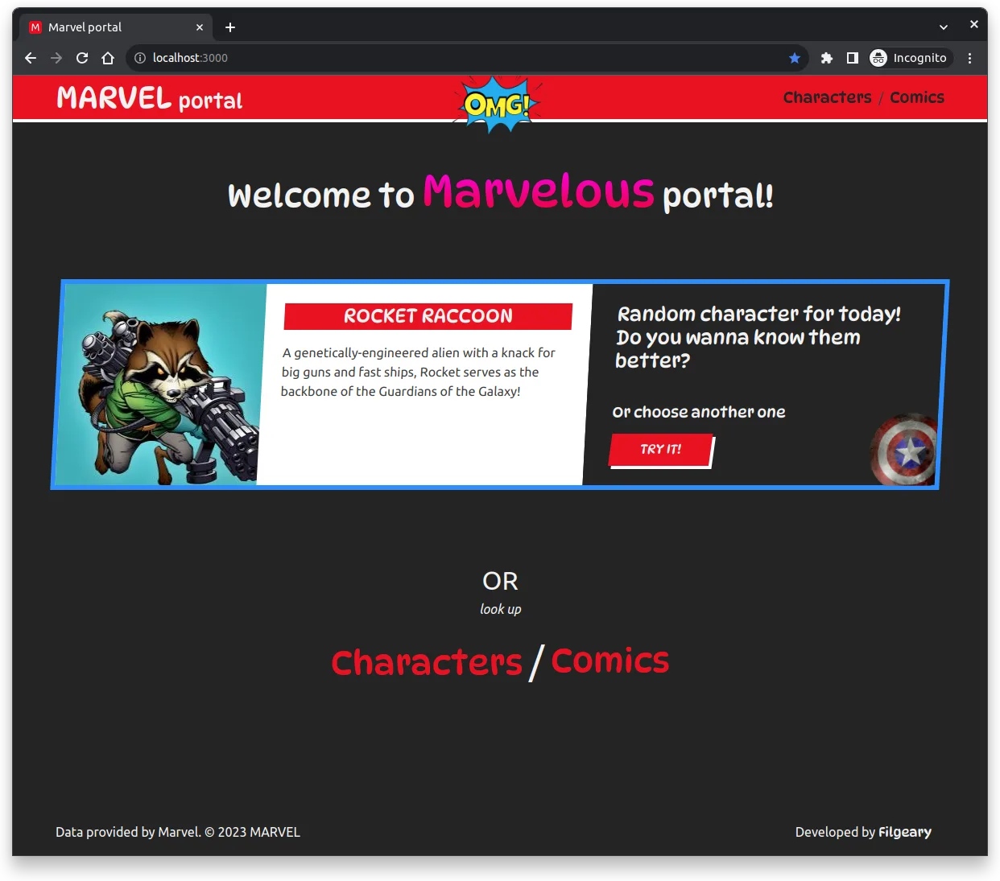
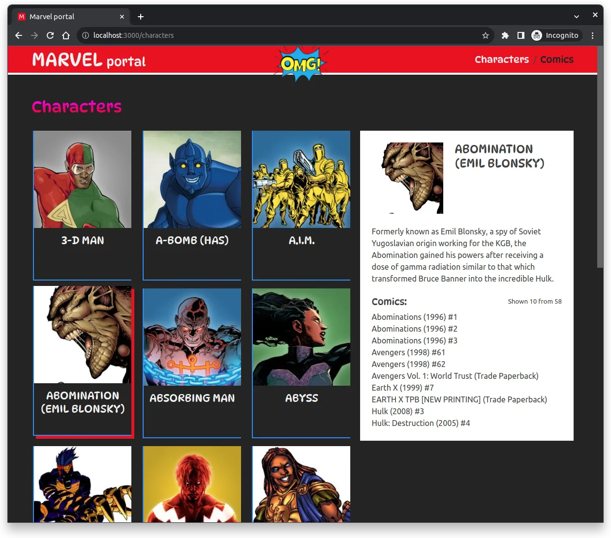
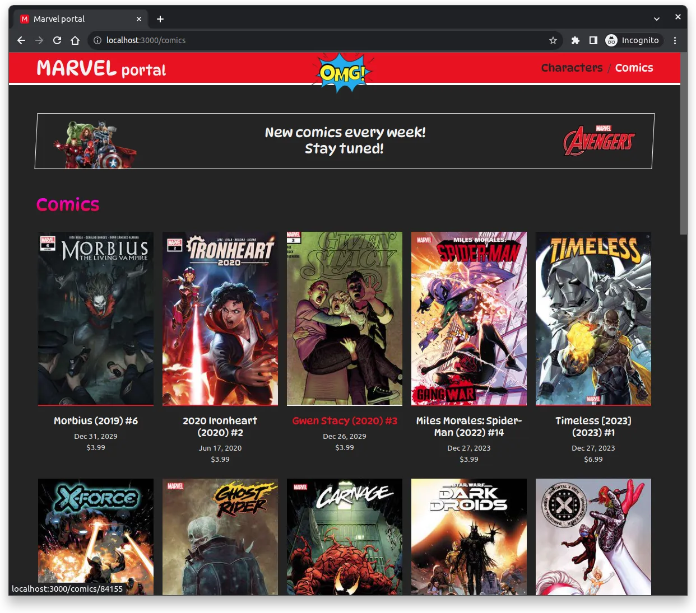
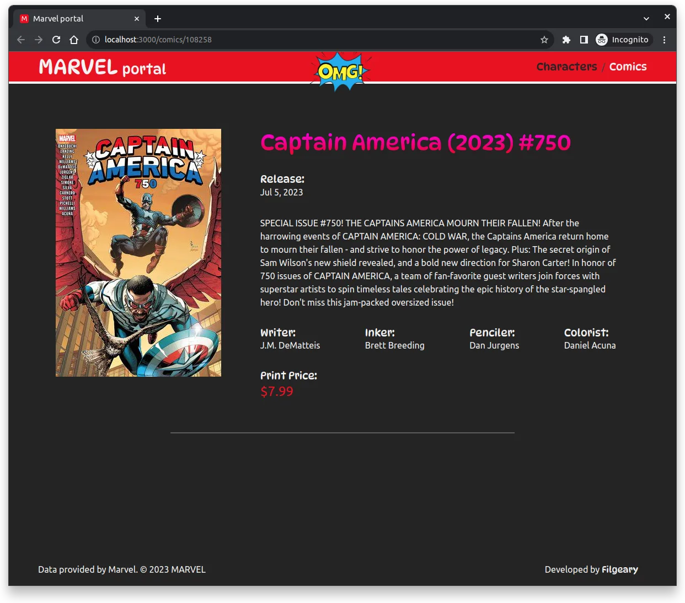

# marvel-portal

> ⚠️ WIP
>
> tested on desktop resolution > 1200px
>
> based on CRA 5 & React 18
>
> for fun & learning purpose 😃

Marvel Portal with Characters / Comics using official Marvel API

## Tech Stack

- React 18, Hooks
- Custom Hooks
- React Router
- CSS Modules
- Typed API Models with `d.ts`
- Animations (React-Transition-group)
- Testing
  - React-Testing-library (unit & integration)
  - MSW (API mocking)

## Features

- Random Character block
- Characters List with Character Info
- Comics List
- Pages: Characters/SingleCharacter, Comics/SingleComic

## Dev Features

- npm-scripts (format, lint, check-types)
- codegen to create Components `yarn run codegen YOUR_COMPONENT_NAME`
- GitHub Actions (CodeQL, Lint, Tests)

## TODO

- [ ] Rewrite to TS ?
- [ ] Fetch lib like React Query ?
- [ ] New Features like Favorites, Search, complex Filters ?
- [ ] New Features like Related Data by Char/Comic ?
- [ ] Store/Context ?
- [ ] Auth, External DB ?
- [ ] e2e tests ?

---

## Previews

### Main Screen

### Characters Page

### Comics Page

### Single Comic Page

